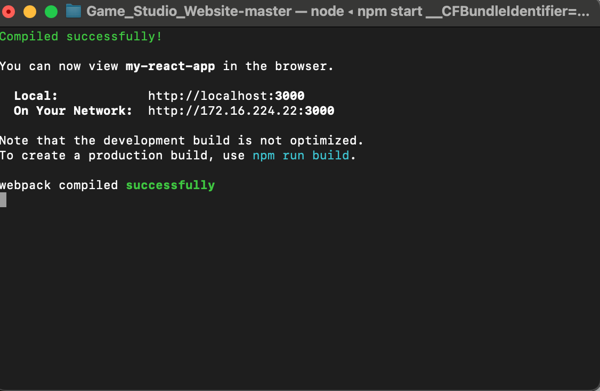

# Game Studio Website
Mockup game studio website that use frrontend framework bootstrap , React libray and webGL API.

---

## Table of Contents
- [About](#19)
- [Features](#25)
- [Technologies](#32)
- [Installation](#40)
- [Usage](#usage)
- [Contributing](#contributing)
- [License](#license)

---

## About
Provide a more detailed explanation of your project.  
Include its purpose, target users, or any unique aspects.

---

## Features
    - Feature 1
    Bootstrap carosel of photos from mockup game studio 
    - Feature 2
    Website navigation bar and links 
    - Feature 3
    Boostraop cards for company and game industry information.

---

## Technologies
- **Frontend:** HTML, CSS, JavaScript, React, Bootstrap.
- **Backend:** Node.js
- **Other:** Figma , WebGL

---

## Installation
Step-by-step instructions to run the project locally:

1. Clone the repository:

Mac
   ```bash
   git clone https://github.com/CesarB-code/Game_Studio_Website.git
   
## Install Node.js
    1. Download the Installer:
    Navigate to the official Node.js website (nodejs.org).
    Download the Long Term Support (LTS) version installer appropriate for your operating system (Windows, macOS, or a Linux distribution). The LTS version is recommended for stability.


    2. Run the Installer:
    Windows/macOS: Locate the downloaded installer file (e.g., .msi for Windows, .pkg for macOS) and double-click to run it.
    Follow the on-screen instructions, accepting the license agreement and choosing the installation location (the default location is usually fine).
    Ensure that the "Add to PATH" option is selected during installation, as this allows you to run Node.js commands directly from your terminal or command prompt.
    Complete the installation process.


    3. Verify the Installation:
    Open your terminal or command prompt.
    Type the following command and press 
    Enter.

    node -v

    This command should display the installed Node.js version, confirming a successful installation.
    You can also verify the npm (Node Package Manager) installation, which is bundled with Node.js, by typing:


        npm -v

    2 Navigate to project directory:

    Windows 

    Example: C:\Users\Desktop> cd Game_Studio_WebSite_Master
    Mac

    Example: cesarbarrera@Cesars-MacBook-Air ~ %  cd Game_Studio_WebSite
    3 Install dependencies:

    Type this command in the terminal window.
    Windows/Mac

        npm install

    4 Start web server :
    Type this comannd in terminal window.

        npm start


## Usage

##Contributing


