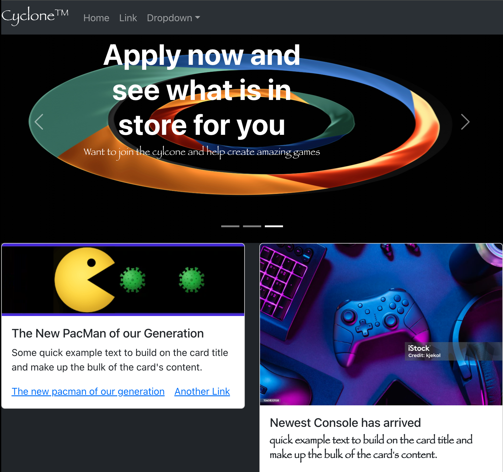
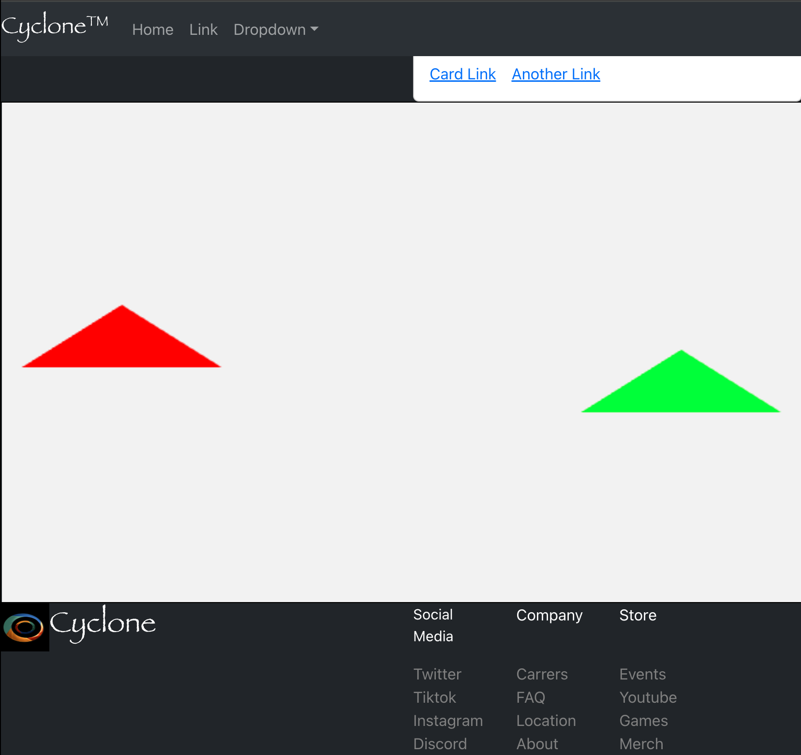

# Game Studio Website

A React-based mock game studio website showcasing interactive content, team/company presentation pages, and a Unity WebGL character demo.

Design outline: https://app.milanote.com/1WeyYy1cxwxE6X?p=htqbP6GD0Ju

## Table of Contents

- [Overview](#overview)
- [Features](#features)
- [Tech Stack](#tech-stack)
- [Project Structure](#project-structure)
- [Getting Started](#getting-started)
- [Available Scripts](#available-scripts)
- [Usage](#usage)
- [Screenshots](#screenshots)
- [Roadmap Ideas](#roadmap-ideas)

## Overview

This project is a frontend portfolio-style website for a fictional game studio called Cyclone. It is designed to present:

- Brand identity and studio messaging
- Featured content and visual carousels
- Team, profile, events, and store pages
- A Unity-powered interactive web demo

The app uses React routing for page navigation and Bootstrap for responsive layout and components.

## Features

- Multi-page navigation with React Router
- Homepage  and studio introduction content
- Carousel-based content sections
- Team members, profile, events, and store pages
- Unity WebGL character/demo integration
- Reusable component-driven page sections
- Responsive layout with React Bootstrap

## Tech Stack

- Frontend: React, JavaScript, HTML, CSS
- UI: Bootstrap, React Bootstrap, React Icons
- 3D/Graphics: Unity WebGL, Three.js, React Three Fiber, Babylon.js
- Routing: React Router
- Tooling: Create React App (react-scripts), npm

## Project Structure

```text
Game_Studio_Website/
|- public/
|  |- WebGLBuild/                # Unity WebGL exported build assets
|  |- index.html
|- src/
|  |- components/
|  |  |- Routes.js               # App route definitions
|  |  |- UnityCharacter/         # Unity character wrapper/component
|  |  |- pages/
|  |  |  |- VideoHome/           # Landing page
|  |  |  |- About/
|  |  |  |- Profile/
|  |  |  |- Events/
|  |  |  |- TeamMember/
|  |  |  |- Store/
|  |  |  |- wp-coponents/        # Shared page widgets/components
|  |- index.js
|- package.json
|- README.md
```

## Getting Started

### Prerequisites

- Node.js 18+ recommended
- npm (comes with Node.js)

### Installation

1. Clone the repository:

```bash
git clone https://github.com/CesarB-code/Game_Studio_Website.git
```

2. Move into the project folder:

```bash
cd Game_Studio_Website
```

3. Install dependencies:

```bash
npm install
```

4. Start the development server:

```bash
npm start
```

The app will run at http://localhost:3000.

## Available Scripts

In the project directory, you can run:

- `npm start`: Runs the app in development mode.
- `npm test`: Launches the test runner.
- `npm run build`: Builds the app for production into the `build/` folder.
- `npm run eject`: Ejects Create React App configuration (one-way operation).

## Usage

- Open the homepage to view the Cyclone studio introduction.
- Use the navigation menu to move between About, Team Members, Profile, Events, and Store pages.
- Visit sections with Unity content to interact with the embedded WebGL demo.

No login or account is required.

## Screenshots

### Terminal Run


### Website Preview 1



### Website Preview 2



## Roadmap Ideas

- Add a backend/API for dynamic event and store data
- Improve accessibility and keyboard navigation
- Add end-to-end tests for route flows
- Optimize Unity asset loading and lazy loading behavior


 


